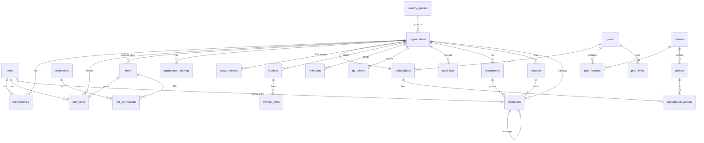

# RemoteWay — Architecture Report & Roadmap

This report answers section 95 of the product brief (A–M). Sections marked **Built** exist in this repository and are covered by tests. The rest is the plan.

---

## A. Current stack

The request was to put the whole platform on **Node.js**, deploy it on **Orange Host** (cPanel shared hosting), and keep **all data in the database**.

- The GitHub repository was **empty** when this work started, and the earlier session linked in the request was not accessible from this environment. So there was no existing code to keep or migrate. Everything here is new.
- Chosen stack:

| Layer | Choice | Why |
|---|---|---|
| Runtime | Node.js ≥ 18.18, CommonJS | Supported by cPanel *Setup Node.js App* (CloudLinux / Passenger) |
| Web | Express 4 | Mature and small, works under Passenger |
| Views | EJS, server-rendered + progressive-enhancement JS | **No build step on the server**; fast first paint; works without JS |
| DB | MySQL 8 / MariaDB via `knex` + `mysql2` | This is what Orange Host provides. Migrations are versioned in git |
| Sessions | `express-session` + `connect-session-knex` → MySQL `sessions` table | Data lives in the database, not on local disk or in memory |
| Security | `helmet` (strict CSP), CSRF tokens, `bcryptjs`, `express-rate-limit` | Pure JS: no native modules to compile on shared hosting |
| Validation | `zod` | One schema per input, shared by the web UI and the API |
| Tests | `node:test` + `supertest` against a real MySQL test DB | No mocks for tenancy or limits |

## B. Current architecture — **Built**

A **modular monolith**:

```
Request ─► helmet/CSP ─► session (MySQL) ─► loadUser (session | Bearer token)
        ─► locals (i18n, theme) ─► CSRF ─► requireAuth ─► resolveTenant
        ─► can('perm') / feature('key') ─► route ─► *.service.js ─► knex ─► MySQL
                                                            └─► audit.record()
```

- **Controllers stay thin.** Routes (`web.js`, `routes/api.js`) parse input and call services. Business rules live in `src/modules/*/**.service.js`.
- **`req.ctx`** = `{ organizationId, userId, permissions, ip, userAgent }`. Every service takes `ctx` and filters by `ctx.organizationId`.
- **One service layer serves both the web UI and the REST API**, so rules cannot drift apart.
- **Caching:** an in-process TTL cache for entitlements, permissions, org settings and dashboard metrics, invalidated on writes (TTL 60 s by default).
- **Errors:** `AppError(code, message, status, details)` with stable codes, e.g. `EMPLOYEE_LIMIT_REACHED`, `FEATURE_NOT_IN_PLAN`, `SUBSCRIPTION_INACTIVE`, `PERMISSION_DENIED`, `VALIDATION_FAILED`.

## C. Problems / constraints identified

1. **Shared hosting limits:** there is no Redis, no long-running workers, and processes may be recycled. Queues and caches have to degrade gracefully. Phase 1 needs no queue. Later phases use a DB-backed job table plus a cPanel cron (see Risks).
2. **MySQL vs MariaDB JSON:** MySQL 8 returns JSON columns parsed, while MariaDB returns them as text. The code normalizes both (settings are stored as `{"v": …}`).
3. **No card payment gateway yet:** billing issues real invoices with VAT, and a super admin confirms offline payment. The UI says this explicitly.
4. **No email provider yet:** an invitation creates a one-time link that the admin copies. The UI says this explicitly.
5. **Brand font:** *Montserrat Arabic* is licensed separately and is a drop-in (see README).

## D. Reusable components

- The design system in `public/css/app.css` (tokens, light/dark, RTL-safe logical properties): buttons, inputs, selects, tables, toolbars, pagination, tabs, badges, alerts, dialogs, dropdown menus, KPI strip, meters, bar/column charts, split bars, activity feed, action list, empty states, skeletons, command palette.
- The EJS partials `field`, `pagination`, `status-badge`, `audit-table`, `plan-picker` and `pricing-cards`.
- The core services `entitlements.service` (plan/feature/limit engine), `rbac.service`, `audit`, `validate`, `cache` and `i18n`. Every future module plugs into these.

## E. Proposed architecture

```
                 REMOTEWAY  (modular monolith, one Node process per Passenger worker)
                                        │
     ┌──────────────────────┬───────────┴───────────┬────────────────────────┐
  SaaS CORE (built)     WORKFORCE / TALENT       INTEGRATION HUB          AI LAYER
  auth · orgs · rbac    employees (built)        IntegrationProvider      AiService
  subscriptions ·       attendance · leave ·     ├ PayWayProvider         ├ provider adapters
  billing · audit ·     payroll · performance ·  ├ EmailProvider          │ (OpenAI/Anthropic/
  super admin           learning · recruitment   ├ SmsProvider            │  Gemini/Azure)
                                                 └ AccountingProvider     └ usage + cost ledger
                                        │
                           SUBSCRIPTION ENGINE (plan + add-ons + custom limits)
                                        │
                    Company workspace · Employee portal · Client portal · REST API
```

- New module = `src/modules/<name>/` (service + web + api routes), a migration, permissions in `catalog.js`, and a feature key in `FEATURES`. Its availability changes from `coming_soon` to `available` when it ships.
- **Country Policy Engine:** `country_policies` (currency, timezone, working week, VAT, `rules` JSON). Payroll and leave rules will read from it, never from controllers.

## F. Database ERD (Phase 1 — **Built**)



Upcoming tables (per phase): `employee_documents, employee_contracts, employee_bank_accounts, attendance, timesheets, leave_types, leave_balances, leave_requests, notifications, email_templates` (P2) · `jobs, candidates, applications, interviews, assessments` (P3) · `payrolls, payroll_items, payslips` (P4) · `performance_cycles, goals, kpis, performance_reviews` (P5) · `courses, learning_paths, enrollments, certificates` (P6) · `integrations, integration_credentials, integration_logs, webhooks, webhook_deliveries, jobs_queue` (P7) · `ai_requests, ai_usage, ai_logs` (P8) · `support_tickets, service_requests` (client success).
All of them carry `organization_id` and a composite index that starts with it.

## G. Module map

| # | Module | Phase | Status |
|---|---|---|---|
| 1 | Dashboard + Action center | 1 | **Built** (workforce figures; other modules show their phase) |
| 2 | Auth, Organizations, Switcher, Onboarding wizard | 1 | **Built** |
| 3 | Users, Roles, Permissions, Invitations, API tokens | 1 | **Built** |
| 4 | Plans, Features, Limits, Add-ons, Subscriptions, Invoices | 1 | **Built** |
| 5 | Employees, Departments, Locations | 1–2 | **Built** (core); CSV import in P2 |
| 6 | Super Admin (tenants, plans, invoices, audit) | 1 | **Built** |
| 7 | Documents, Attendance, Leave, Tasks/Projects, Notifications, CSV import | 2 | **Built** (email templates & compliance dashboard move to Phase 3) |
| 8 | Recruitment/ATS, Candidates, Interviews, Assessments, public careers page, Onboarding checklists | 3 | **Built** |
| 9 | Payroll, Payslips, Allowances/Deductions (Country Policy Engine: Saudi GOSI) | 4 | **Built** |
| 10 | Performance (Goals/OKRs, check-ins, review cycles, competencies, feedback) | 5 | **Built** |
| 11 | Learning (Courses, lessons & quizzes, Paths, Assignments, Certificates) | 6 | **Built** |
| 12 | Integration hub: Webhooks, SMS, Chat, Calendar feeds, Email (SMTP), background jobs; PayWay awaiting API docs; Accounting later | 7 | **Built** |
| 13 | AI layer (providers, governance, metering; recruitment, documents, performance, learning, analytics assistant) | 8 | **Built** |
| 14 | SSO (OIDC), approval workflows, reports (templates, builder, schedules), client success portal | 9 | **Built** |

### API map (v1)

**Built:** `GET /plans` (public) · `GET /auth/me` · `GET /organizations/current` · `GET /subscription` · `GET /dashboard` · `GET /search` ·
`GET|POST /employees` · `GET|PATCH|DELETE /employees/:id` · `POST /employees/:id/terminate` · `GET|POST /departments` · `PATCH|DELETE /departments/:id` ·
`GET|POST /locations` · `DELETE /locations/:id` · `GET /users` · `GET /roles` ·
`/leave/*` · `/attendance/*` · `/documents` · `/tasks` · `/notifications` ·
`GET|POST /recruitment/jobs` · `GET /recruitment/jobs/:id` · `POST /recruitment/jobs/:id/status` · `GET /recruitment/jobs/:id/applications` ·
`GET|POST /recruitment/candidates` · `GET /recruitment/candidates/:id` · `GET /recruitment/applications/:id` · `POST /recruitment/applications/:id/stage` · `GET /recruitment/interviews` ·
`GET|POST /onboarding/plans` · `GET /onboarding/plans/:id` · `POST /onboarding/tasks/:id` ·
`GET|POST /payroll/runs` · `GET /payroll/runs/:id` · `POST /payroll/runs/:id/{submit|reopen|approve|pay|cancel}` · `GET /payroll/payslips/mine` · `GET /payroll/payslips/:id` ·
`GET|POST /performance/goals` · `GET /performance/goals/:id` · `POST /performance/goals/:id/checkins` · `GET /performance/reviews/:id` · `GET|POST /performance/feedback` ·
`GET /learning/courses` · `GET /learning/courses/:id` · `POST /learning/courses/:id/enroll` · `POST /learning/courses/:id/assign` · `GET /learning/me` · `GET /learning/enrollments`.
Auth is `Authorization: Bearer rw_…` (Settings → API; requires the `api` feature, metered against `api_calls_monthly`) or the browser session plus the `X-CSRF-Token` header.

**Planned:** `/projects, /integrations, /payway, /webhooks, /reports, /ai`.

## H. Permission matrix — **Built** (system roles; Super Admin is a platform flag outside tenants)

| Permission | owner | admin | hr_manager | recruiter | finance_manager | payroll_manager | department_manager | team_manager | employee |
|---|:-:|:-:|:-:|:-:|:-:|:-:|:-:|:-:|:-:|
| `organization.manage` | ✓ | ✓ |  |  |  |  |  |  |  |
| `settings.manage` | ✓ | ✓ |  |  |  |  |  |  |  |
| `users.view` | ✓ | ✓ | ✓ |  |  |  |  |  |  |
| `users.manage` | ✓ | ✓ |  |  |  |  |  |  |  |
| `roles.manage` | ✓ | ✓ |  |  |  |  |  |  |  |
| `billing.view` | ✓ | ✓ |  |  | ✓ |  |  |  |  |
| `billing.manage` | ✓ |  |  |  |  |  |  |  |  |
| `audit.view` | ✓ | ✓ |  |  |  |  |  |  |  |
| `api.manage` | ✓ | ✓ |  |  |  |  |  |  |  |
| `integrations.manage` | ✓ | ✓ |  |  |  |  |  |  |  |
| `employees.view` | ✓ | ✓ | ✓ | ✓ | ✓ | ✓ |  |  |  |
| `team.view` | ✓ | ✓ |  |  |  |  | ✓ | ✓ |  |
| `employees.create` | ✓ | ✓ | ✓ |  |  |  |  |  |  |
| `employees.edit` | ✓ | ✓ | ✓ |  |  |  |  |  |  |
| `employees.delete` | ✓ | ✓ | ✓ |  |  |  |  |  |  |
| `employees.view_salary` | ✓ | ✓ | ✓ |  | ✓ | ✓ |  |  |  |
| `departments.manage` | ✓ | ✓ | ✓ |  |  |  |  |  |  |
| `locations.manage` | ✓ | ✓ | ✓ |  |  |  |  |  |  |
| `attendance.view` | ✓ | ✓ | ✓ |  |  | ✓ | ✓ | ✓ |  |
| `attendance.manage` | ✓ | ✓ | ✓ |  |  |  |  |  |  |
| `leave.view` | ✓ | ✓ | ✓ |  |  | ✓ | ✓ | ✓ |  |
| `leave.request` | ✓ | ✓ | ✓ | ✓ | ✓ | ✓ | ✓ | ✓ | ✓ |
| `leave.approve` | ✓ | ✓ | ✓ |  |  |  | ✓ | ✓ |  |
| `payroll.view` | ✓ | ✓ |  |  | ✓ | ✓ |  |  |  |
| `payroll.process` | ✓ | ✓ |  |  |  | ✓ |  |  |  |
| `performance.view` | ✓ | ✓ | ✓ |  |  |  | ✓ | ✓ |  |
| `performance.manage` | ✓ | ✓ | ✓ |  |  |  | ✓ |  |  |
| `recruitment.view` | ✓ | ✓ | ✓ | ✓ |  |  |  |  |  |
| `recruitment.manage` | ✓ | ✓ | ✓ | ✓ |  |  |  |  |  |
| `documents.view` | ✓ | ✓ | ✓ | ✓ |  |  |  |  |  |
| `documents.manage` | ✓ | ✓ | ✓ |  |  |  |  |  |  |
| `payway.view` | ✓ | ✓ |  |  | ✓ | ✓ |  |  |  |
| `payway.manage` | ✓ | ✓ |  |  |  | ✓ |  |  |  |
| `reports.view` | ✓ | ✓ | ✓ |  | ✓ | ✓ | ✓ |  |  |

`team.view` limits a manager to their own reporting line (a recursive CTE over `manager_id`). A user without `employees.view` or `team.view` sees only their own record. Salary fields are removed from service output unless the user has `employees.view_salary`.

## I. Subscription matrix — **Built** (initial seed; prices and limits are edited in Super Admin → Plans and are never hardcoded in the app)

| Feature | Availability | Starter | Business | Professional | Enterprise |
|---|---|:-:|:-:|:-:|:-:|
| Employee Management (`employees`) | available | ✓ | ✓ | ✓ | ✓ |
| Departments & Locations (`departments`) | available | ✓ | ✓ | ✓ | ✓ |
| Attendance (`attendance`) | available | ✓ | ✓ | ✓ | ✓ |
| Leave (`leave`) | available | ✓ | ✓ | ✓ | ✓ |
| Documents (`documents`) | available | ✓ | ✓ | ✓ | ✓ |
| Tasks (`tasks`) | available | ✓ | ✓ | ✓ | ✓ |
| Basic Reports (`basic_reports`) | available | ✓ | ✓ | ✓ | ✓ |
| Recruitment (ATS) (`recruitment`) | available |  | ✓ | ✓ | ✓ |
| Onboarding (`onboarding`) | available |  | ✓ | ✓ | ✓ |
| Payroll (`payroll`) | available |  | ✓ | ✓ | ✓ |
| Performance (`performance`) | available |  | ✓ | ✓ | ✓ |
| Learning (`learning`) | available |  | ✓ | ✓ | ✓ |
| Projects (`projects`) | available |  | ✓ | ✓ | ✓ |
| Advanced Reports (`advanced_reports`) | available |  | ✓ | ✓ | ✓ |
| Integrations (`integrations`) | available |  | ✓ | ✓ | ✓ |
| Advanced Analytics (`analytics`) | available |  |  | ✓ | ✓ |
| Compliance (`compliance`) | available |  | ✓ | ✓ | ✓ |
| API Access (`api`) | available |  |  | ✓ | ✓ |
| Advanced Permissions (`advanced_permissions`) | available |  |  | ✓ | ✓ |
| Custom Roles (`custom_roles`) | available |  |  |  | ✓ |
| Advanced Automation (`automation`) | available |  |  | ✓ | ✓ |
| Single Sign-On (`sso`) | available |  |  |  | ✓ |
| Custom Workflows (`custom_workflows`) | available |  |  |  | ✓ |
| Enterprise Reporting (`enterprise_reporting`) | available |  |  |  | ✓ |
| PayWay Integration (`payway`) | integration_required |  |  |  |  |
| AI Recruitment (`ai_recruitment`) | available |  |  | ✓ | ✓ |
| AI Documents (`ai_documents`) | available |  |  | ✓ | ✓ |
| AI Performance (`ai_performance`) | available |  |  | ✓ | ✓ |
| AI Learning (`ai_learning`) | available |  |  | ✓ | ✓ |
| AI Analytics (`ai_analytics`) | available |  |  | ✓ | ✓ |
| Client Success Portal (`client_success`) | available |  |  |  | ✓ |

| Limit | Starter | Business | Professional | Enterprise |
|---|--:|--:|--:|--:|
| `employees` | 10 | 50 | 250 | ∞ |
| `users` | 5 | 25 | 100 | ∞ |
| `storage_mb` | 5120 | 51200 | 256000 | ∞ |
| `api_calls_monthly` | 0 | 0 | 50000 | ∞ |
| `ai_requests_monthly` | 0 | 0 | 5000 | ∞ |
| `active_jobs` | 0 | 20 | 100 | ∞ |
| Price / month (SAR, initial) | 199 | 699 | 2499 | Custom |

Blank limit = unlimited, `0` = not included. Add-ons (extra employees/storage, AI pack, API access, PayWay, SSO, Recruitment, Learning, Advanced Payroll, Advanced Analytics) add features or raise limits × quantity. Negotiated per-tenant overrides live in `subscriptions.custom_limits`.
Statuses are `trial → active → past_due (grace) → suspended / cancelled`. An expired trial, or a grace period that has run out, makes the workspace **read-only** (`SUBSCRIPTION_INACTIVE`).
Limit checks run inside a transaction that holds `SELECT … FOR UPDATE` on the tenant's subscription row, so concurrent requests cannot exceed a limit (covered by a test).

## J. AI architecture (Phase 8 — built)

- **`AiService`** with operations `generateText, analyzeText, extractData, classify, summarize, match, recommend`, and **provider adapters** (`OpenAIProvider`, `AnthropicProvider`, `GeminiProvider`, `AzureOpenAIProvider`). Provider, model and API key are chosen by the super admin, and keys are stored encrypted.
- **Pipeline:** request → permission check (`ai.<feature>` + data scope: self / team / HR / finance) → retrieve the minimum data needed → sanitize (strip IDs, salaries and national IDs unless needed) → provider → validate the output (schema) → display as a *draft or insight*. The AI never makes hire/fire/promote/salary/disciplinary decisions.
- **Governance:** org-level switch plus per-feature switches (Recruitment AI, Documents AI, Performance AI, Analytics AI, Learning AI), gated by plan features `ai_*`.
- **Cost control:** `ai_requests` rows (org, user, feature, provider, model, tokens in/out, estimated cost, latency, status) are metered against `ai_requests_monthly` (plan + AI Pack add-on).
- **Numbers never come from the model:** the analytics assistant calls SQL-backed metric functions and the model only explains the results.
- **Implementation:** `src/modules/ai/` — `providers.js` (adapters), `ai.service.js` (pipeline, governance, quota, logging, insights), `features.js` (tasks), `metrics.js` (SQL metrics), `extract.js` (docx text / file attachments), `web.js`. Tables `ai_settings`, `ai_requests`, `ai_insights`; the provider config is `platform_settings.ai`.
- **Failure fallback:** every AI action is optional. If a call fails, the manual form stays usable.

## K. PayWay architecture (Phase 7 — planned; no endpoints invented)

```
Payroll / Employees ─► domain events (payroll.approved, employee.updated)
                          │
                   IntegrationHub ─► IntegrationProvider (interface)
                                        └─ PayWayProvider
                                             connect() disconnect() testConnection()
                                             syncEmployees() syncPayroll()
                                             getEmployeeStatus() getAvailableAmount()
                                             createRequest() getRequestStatus() handleWebhook()
```

- Each method throws `INTEGRATION_NOT_CONFIGURED` until it is implemented against the **official PayWay API documentation**. No auth scheme or endpoint is assumed.
- Tables: `integrations` (status: not_connected / connected / syncing / error / disconnected), `integration_credentials` (encrypted), `integration_logs`, `webhooks` (inbound, with signature verification and replay protection), `integration_mappings` (employee ↔ PayWay IDs).
- Sync runs as DB-queued jobs processed by a cron worker (`npm run worker`), with retry, backoff and a dead-letter state.
- The employee-facing *My Pay → Earned Wage Access* screen stays disabled ("Integration required") until PayWay is certified. No transactions are simulated.

## L. Development phases

| Phase | Scope | Exit criteria |
|---|---|---|
| **1 — SaaS Core** | Auth, multi-tenancy, orgs, users, roles, permissions, plans, features, subscriptions, limits, billing foundation, dashboard | ✅ Done: 33 integration tests (tenant isolation, limits, RBAC, subscription, CSRF/auth) |
| **2 — Workforce** | Documents (private storage, versions, expiry), attendance, leave (types, balances, approvals, calendar), tasks & projects, notifications (in-app + SMTP email), CSV import wizard | ✅ Done — 20 more integration tests (leave scope/balances, attendance, document access & CSRF on uploads, tasks visibility, import limits) |
| **3 — Talent** | Jobs, candidates (private CVs), pipeline board, interviews & feedback, assessments, hire → employee → onboarding, public careers page, onboarding templates & plans | ✅ Done — 19 more integration tests (plan gating, active-jobs & seat limits, CV isolation, interviewer-only feedback, careers page consent/honeypot/CSRF, onboarding assignees & completion) |
| **4 — Payroll** | Compensation & bank details, payroll runs (draft → review → approved → paid, four-eyes), payslips, Saudi GOSI via the Country Policy Engine, proration, unpaid leave, adjustments, register/bank/GOSI exports | ✅ Done — 23 more tests (13 pure calculation tests + 10 integration: GOSI, proration, unpaid leave, workflow & locking, four-eyes, payslip visibility, isolation, exports) |
| **5 — Performance** | Goals/OKRs with key results and check-ins, alignment, review cycles (self + manager, weighted scores, release on close, acknowledgement), competencies, feedback | ✅ Done — 10 more tests (OKR maths, scoring, goal permissions & visibility, cycle workflow, hidden manager assessment, feedback privacy) |
| **6 — Learning** | Courses (text, video, file, link, quiz), catalog, assignments, paths, progress, certificates with public verification and expiry, reports | ✅ Done — 12 more tests (safe content, embeds, publishing rules, access to lessons/files, assignment scope, quiz scoring, certificates & verification, retake, paths) |
| **7 — Integrations** | Integration hub, database job queue (retries, cron script), encrypted credentials, SSRF-safe HTTP, signed outbound webhooks, SMS (Taqnyat/Unifonic/Msegat), Slack/Google Chat, ICS calendar feeds, SMTP & jobs in Super Admin; PayWay adapter once docs are available | ✅ Done — 15 more tests (encryption, SSRF blocking, signatures, phone normalisation, ICS, webhook outbox/retry/auto-disable, SMS formats, chat, calendar feeds, queue) — 136 total |
| **8 — AI** | Provider adapters (Anthropic, OpenAI, Gemini, Azure OpenAI), Super Admin config (encrypted key, test, usage), company switches, metered `ai_requests`, schema-validated output, redaction; job drafts, candidate requirement match, document summaries & dates, review drafts, quiz generation, analytics assistant over SQL metrics | ✅ Done — 17 more tests (redaction, provider formats, governance, quota & refunds, invalid output, CV/PDF handling, access rules, tenant isolation, analytics scoping, admin key storage) — 153 total |
| **9 — Enterprise** | SSO over OpenID Connect (PKCE, JWKS-verified ID tokens, domains, JIT, enforcement with owner break-glass); multi-step leave approval workflows; reports (templates, builder over 8 datasets, saved/shared, scheduled CSV email in the org time zone); support tickets with SLA targets and a Super Admin inbox. SAML is not included (all major IdPs offer OIDC) | ✅ Done — 15 more tests (token verification, SSO flows/JIT/domains/enforcement, workflow order/skip/reject/balance, report safety/tiers/schedules/time zones, tickets/SLA/internal notes/isolation) — 168 total |
| **Advanced Analytics** | Workforce, retention, absence (incl. Bradford factor), attendance, hiring funnel and payroll-cost analytics with period/department filters, permission-scoped sections, server-rendered SVG charts with table views and CSV | ✅ Done — 9 more tests (figures against hand-counted data, funnel from stage history, approved-only costs, permissions, plan gating, rendering/CSV, chart escaping and ticks) — 177 total |
| **Compliance** | Ten rule-based checks (documents, WPS, GOSI, Art. 109 leave, Art. 53 probation, Art. 98 hours, policies, nationality), weighted score with daily snapshots, upcoming expiries, configurable rules, annual-leave fix, policy acknowledgements per version | ✅ Done — 5 more tests (each check on crafted data, fix, rules, acknowledgements & versions, permissions/plan) — 182 total |
| **Advanced Automation** | Event and date triggers, conditions, notify / task / course / chat actions, outbox queuing, once-per-occurrence runs, loop protection, dry-run preview, run history, templates | ✅ Done — 7 more tests (event and date rules, conditions and skip log, all actions, once-only, no loops, preview, validation/permissions/isolation) — 189 total |

**Definition of done per module:** migration + service + web UI + API + validation + permissions + tenant isolation + loading/empty/error states + responsive + Arabic + English + tests.

## M. Risks

| Risk | Impact | Mitigation |
|---|---|---|
| Shared hosting resource limits (CPU/RAM, process recycling) | Slow pages under load | Server rendering, a small dependency set, TTL caching, indexed queries. Move to a VPS when needed; the code is unchanged |
| No persistent queue worker on cPanel | Emails, webhooks and sync (P2/P7) | DB-backed job table + cPanel cron every minute; idempotent jobs |
| In-process cache on multiple workers | Up to 60 s of stale entitlements after an admin change | Short TTL, plus invalidation on the writing worker; limit enforcement always re-counts inside a locked transaction |
| No payment gateway yet | Manual activation | Invoices + super-admin confirmation today; add a gateway adapter (e.g. Moyasar/HyperPay/Tap) behind a `PaymentProvider` interface |
| Email not connected | Invitations shared manually | `EmailProvider` in Phase 7 (SMTP from cPanel is enough to start) |
| Regulatory (Saudi labor law, GOSI, WPS, PDPL) | Payroll correctness, data protection | Country Policy Engine with rules reviewed by a local expert; minimal-data AI; audit logs; data residency choice of hosting |
| Brand font licensing | Arabic typography | Drop-in *Montserrat Arabic* files once licensed |
| PayWay API unknown | Integration timeline | Adapter interface ready; implement only against official docs |
